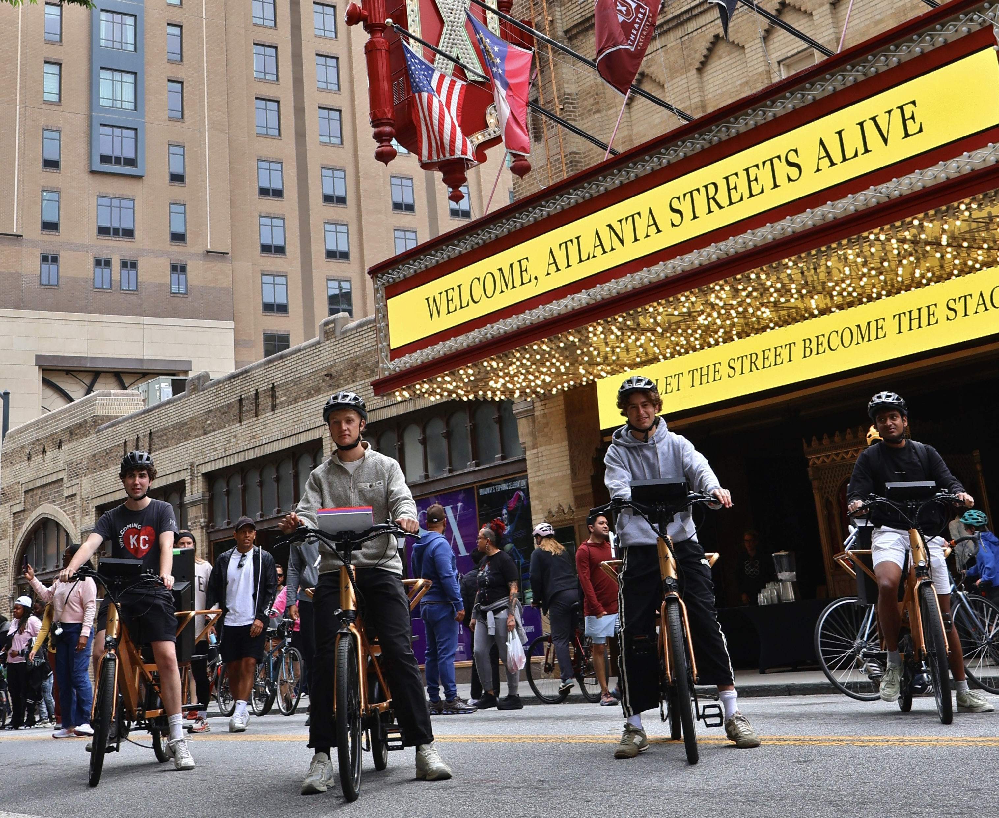
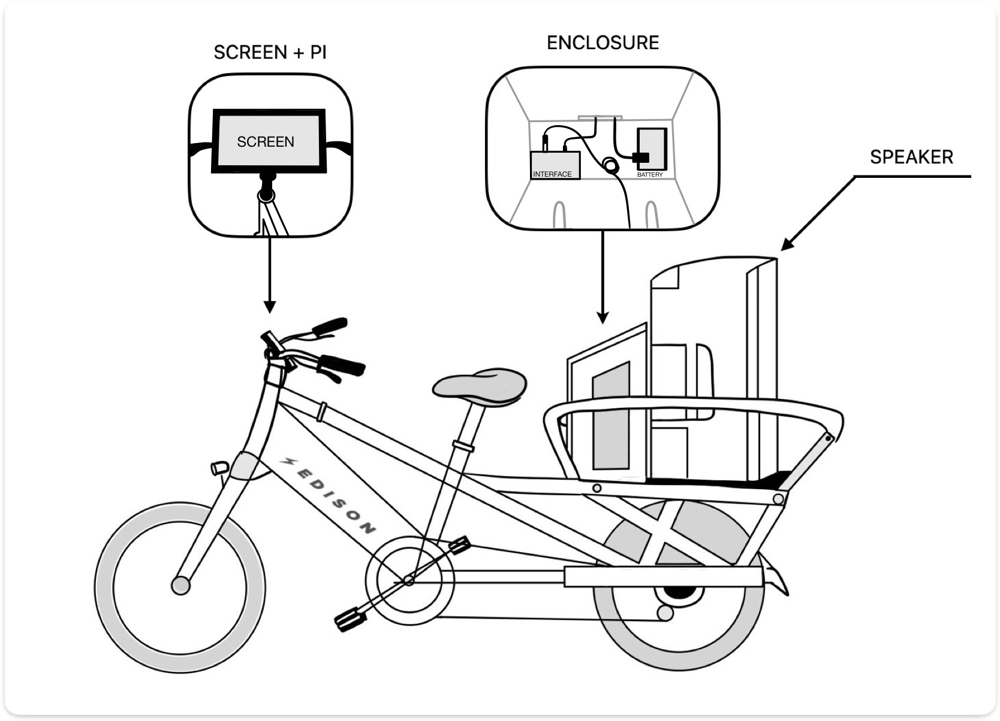
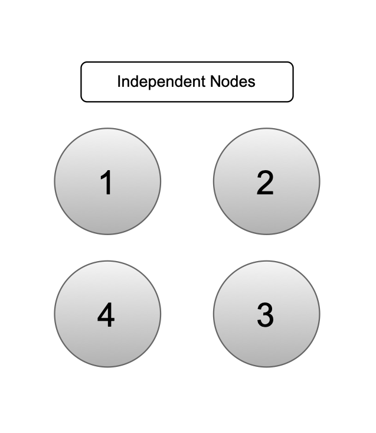
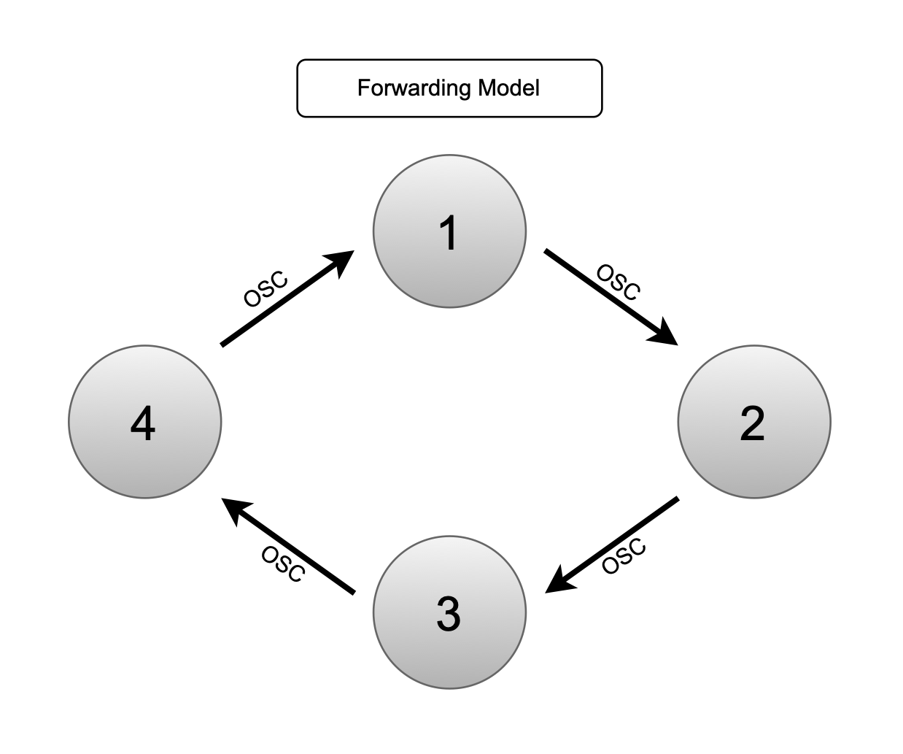
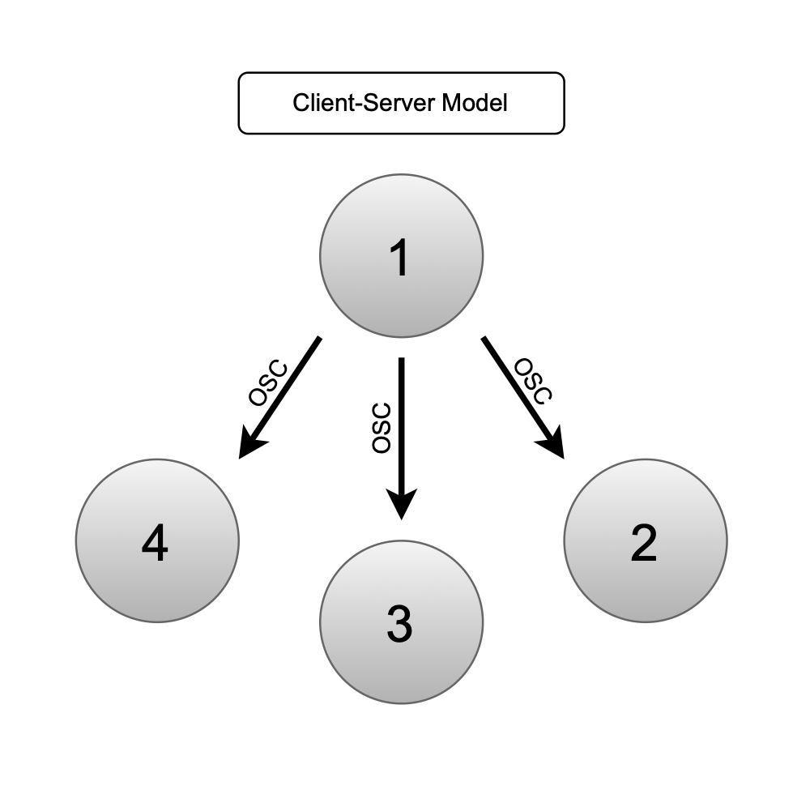
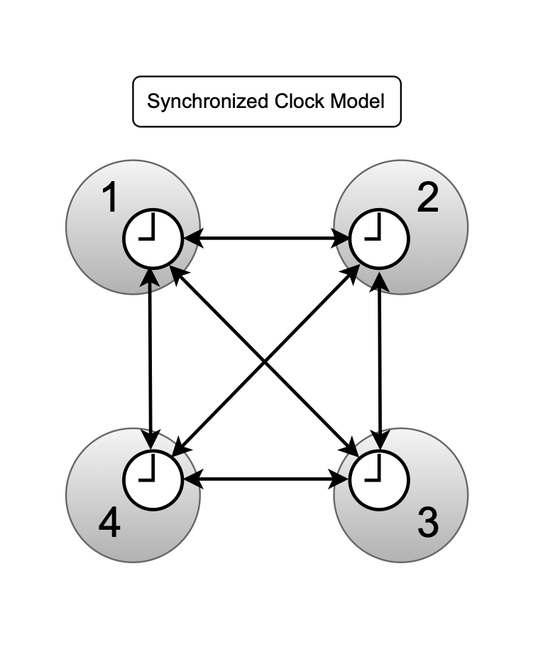
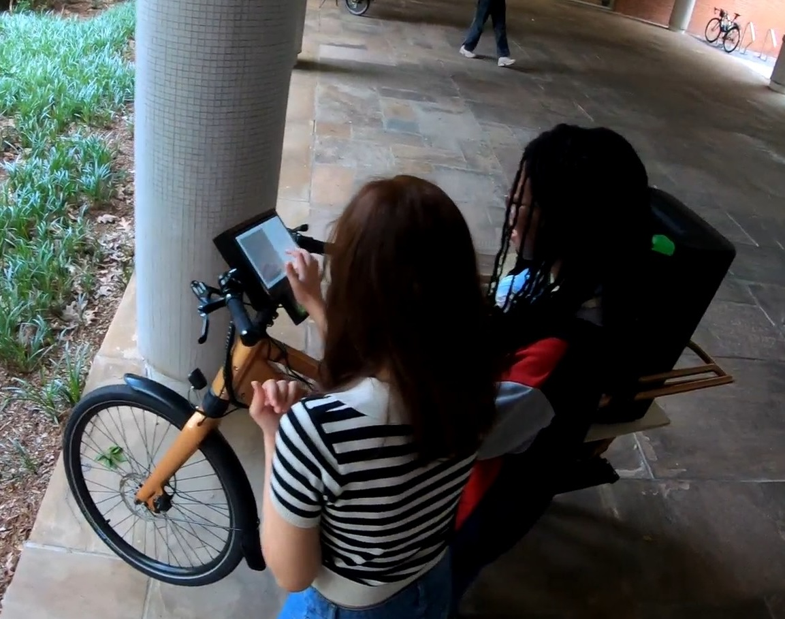

# BIKES




BIKES is a moving networked music instrument consisting of four electric cargo bicycles, each equipped with an onboard computer, touchscreen interface, and a battery-powered loudspeaker. Connected through a wireless mesh network, the four bikes form a single distributed instrument capable of both interactive installations and live performances in motion. The project is developed at the Georgia Institute of Technology, School of Music, as a platform for interdisciplinary research spanning music technology, experimental composition, interaction design, and industrial fabrication.

---

## What It Is

BIKES is both a technical system and an artistic instrument. On the technical side it is a networked cluster of Raspberry Pi computers running SuperCollider, Python, and coordinated via Ansible. On the artistic side it is a spatial sound system designed to engage with urban environments — challenging, complementing, and celebrating the acoustic conditions of the places it moves through.

A key distinction: BIKES is not a *mobile* instrument that happens to move between locations. It is a *moving* instrument. Sound production, spatial perception, and interaction are directly shaped by continuous motion through the environment. The shifting relative positions of the four bikes constantly change how each node's audio mixes for any given listener, making movement itself a compositional parameter.


---

## Repository


The repository to BIKES lives at ! The media folder lives at! After downloading both, the most important thing is that you put the media folder in the root folder of the BIKES repository. The media is kept seperately than the GitHub because GitHub does NOT store large files! 

Add a .gitignore file to the root repository and add the following line. 

/media

That will keep the media from getting pushed to the GitHub.

---

## Hardware



Each bike is built on an Edison Bicycles electric cargo frame (750W motor, 181 kg payload capacity) with a custom-fabricated wooden rear enclosure housing:

- **Raspberry Pi 5** with 10-inch touchscreen, mounted at the handlebars in a 3D-printed enclosure
- **Behringer U-PHORIA UMC22** USB audio interface
- **Mackie Thrash212** battery-powered loudspeaker (1300W, 12" woofer)
- **Ubiquiti UAP-AC-M-US UniFi** mesh router (600 ft outdoor range), connected to the Pi via Ethernet
- **ESP32 UWB Pro with Display (DW1000)** ultra wideband sensor for relative distance measurements.
- **GPS Module** Currently unused but we have many! 


All components run on onboard batteries, enabling hours of operation without external power — a deliberate design choice for accessibility, sustainability, and deployment to locations unreachable by car.

A Phase 2 prototype has been designed featuring a custom CNC-fabricated enclosure positioned around the rear wheel to lower the centre of mass (a key safety improvement identified from field testing), with eight 10.5-inch horn tweeters in a square arrangement for omnidirectional projection.

---

## Software

| Layer | Tool | Role |
|---|---|---|
| Audio engine | SuperCollider | Synthesis, processing, GUIs, OSC communication |
| Beat Synchronization (Short Pieces - Use NTP Time Sync instead) | Ableton Link | Shared tempo/beat across nodes |
| Node communication | P2PSC + OSC | Auto-discovery, inter-node message routing |
| GUI (installations) | Python / Pygame | Touch interfaces for audience interaction |
| Deployment | Ansible | Remote launch, configuration, maintenance |
| Time Synchronization | Chrony (NTP) | Clock synchronization for coordinated playback |

SuperCollider runs headless on each Pi with its own server and language instance. Ansible playbooks launch all software simultaneously across all nodes from a single command, eliminating per-node manual setup on site.

---

## Network

The network is the instrument. BIKES uses a WiFi mesh — one UniFi router per bike, all interconnected — rather than a centralized router, reducing dropouts and single points of failure during rides. Inter-node communication uses OSC for control and synchronization data; real-time audio is not streamed over the network (each node renders audio locally).

P2PSC provides a name-based routing layer on top of OSC, so scripts address nodes by name (e.g. `"2"`) rather than managing IP addresses and ports directly.

The system can express several distinct network topologies, each with different compositional properties:

- **Independent nodes** — each bike plays autonomously; Ansible sets parameters remotely
- **Hierarchical** — one leader node broadcasts OSC to followers
- **Forwarding** — a message passes sequentially around the ring, each node playing and waiting before passing on
- **Synchronized clocks** — Ableton Link aligns tempo and phase across all nodes for distributed rhythmic playback


<div style="display: flex; gap: 10px;">
  
  
</div>

<div style="display: flex; gap: 10px;">
  
  
</div>

---

## Concepts

The software concepts documented here are compositional experiments developed on top of the BIKES infrastructure. Each concept is a self-contained Ansible playbook plus one or more SuperCollider and/or Python scripts, exploring a different interaction model:

| Concept | Core idea |
|---|---|
| [Forwarding](concepts/Forwarding) | Ping chain — a tone passes sequentially around the ring (forwarding model)|
| [Latency Delay](concepts/LatencyDelay) | Explores network delay as a perceptual and compositional element (forwarding + client server model) |
| [Timesync](concepts/Timesync) | Coordinated simultaneous playback using Unix timestamps (synchronized clocks model) |
| [Soundscapes](concepts/Soundscapes) | Touch-triggered layered soundscapes following Schafer's Keynote / Signal / Soundmark framework (forwarding + synchronized clocks model)|
| [Granular Synth](concepts/GranSynth) | Distributed granular synthesis with chord control across nodes (client-server model) |
| [UWB Shape](concepts/Uwb) | Real-time physical formation tracking via Ultra-Wideband ranging, driving spatial sound behaviour (forwarding model) |

---

## Artistic Context




The sound design of BIKES draws on R. Murray Schafer's soundscape framework, distinguishing between Keynote sounds (continuous sonic ground), Signals (foreground events demanding attention), and Soundmarks (sounds tied to the acoustic identity of a place). These categories directly informed the Soundscapes concept and the layered sound design used in public activations.

BIKES has been deployed in a range of public contexts:

- **Georgia Tech Undergraduate Research Symposium** — single-bike durability and UI test
- **Launchpad, College of Design** — quadraphonic interactive installation, thousands of visitors
- **Inman Park Parade** — four bikes performing along a 2-mile route in motion
- **SITE festival, The Goat Farm** — first dedicated distributed soundscape installation
- **Atlanta group ride** — two-hour inner-city ride with 30+ participants, in collaboration with Fulton County Arts & Culture, MOBB ATL, and Red Bike and Green, exploring the acoustic and social affordances of Atlanta's urban environment
- **Hartsfield-Jackson Atlanta International Airport** — year-long exhibition of the Phase 2 prototype with documentary video and posters

---

## Publications

The project has been documented in three peer-reviewed papers:

- Kenny, Gomez, Sathe, von Coler — *"BIKES: A Moving Network Instrument for Music and Sound Art"*, IEEE Internet of Sounds, 2025. Initial prototype, hardware/software architecture, network topologies, first activations.

- Gomez, Decker, Faupel, Pawar, Westerstahl, von Coler — *"BIKES: A Mobile Networked Music Instrument in Interdisciplinary Research and Education"*, ICMC 2026. Project phases, soundscape compositions, Phase 2 prototype design, airport exhibition, interdisciplinary pedagogy.

- *"Sonic Interactions as Situated Urban Practice with BIKES"*, NIME 2026. The Atlanta group ride as a form of situated urban practice; a proposed framework for individual, co-present, and environmental scopes of acoustic interaction.

---

## Project Structure

```
BIKES/
├── sync_folder.yml             # primary deployment script (root)
├── concepts/                   # compositional experiments
│   ├── forwarding/
│   ├── Latency_delay/
│   ├── timesync/
│   ├── soundscapes/
│   ├── GranSynth/
│   └── uwb/
├── media/                      # audio and image assets (per concept)
├── utility/                    # setup and maintenance playbooks
├── config/                     # Ansible inventory files
└── offline-libraries/          # bundled packages for offline install
    ├── p2psc/
    └── chrony_4.8-3_arm64.deb
```